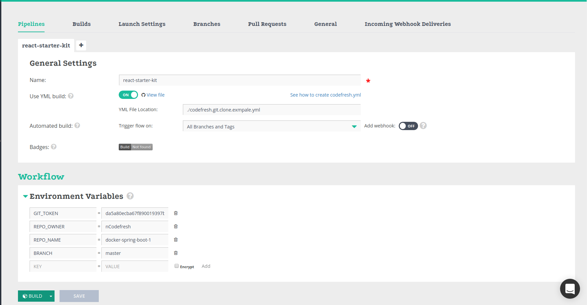

# Welcome

So, you've decided to try Codefresh? Welcome on board!

Using this repository we'll help you figure out with properties of *git-clone* step.

## Looking around

In the root of this repository you'll find a file named `codefresh.yml`, this is our [build descriptor](https://docs.codefresh.io/docs/what-is-the-codefresh-yaml) and it describes the different steps that comprise our process.
Let's quickly review the contents of this file:

## Using This Example

To use this example:

* Fork this repository to your own [INSERT_SCM_SYSTEM (git, bitbucket)] account.
* Log in to Codefresh using your [INSERT_SCM_SYSTEM (git, bitbucket)] account.
* Click the `Add Service` button.
* Select the forked repository.
* Select the `I have a Codefresh.yml file` option.
* Complete the wizard.
* Rejoice!

## Git-clone step with github token

#### How to generate the github token
- Go to the page [Personal access tokens](https://github.com/settings/tokens)
- Generate and configure the access for personal token

####Configuration in Codefresh:
We assume you already forked this repo and create a service for it
- Open the service and add new pipeline
- Switch to `Use YML build`
- Change the `YML File Location` to be `./codefresh.git.clone.example.yml`
- Under Environment variables fill the next variables:
  - `GIT_TOKEN` your personal access token that you generated on github
  - `REPO_OWNER` owner of repository that you want to clone
  - `REPO_NAME` name of repository that you want to clone
  - `BRANCH` branch of repo

Your screen should look like:

